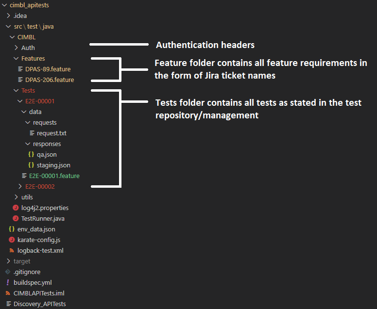
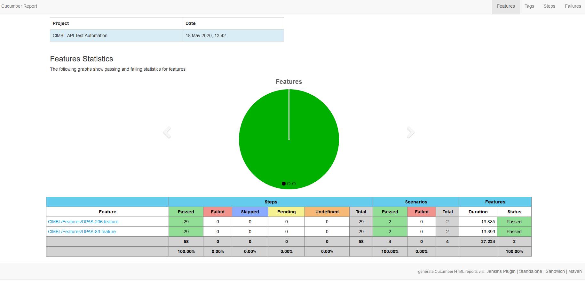

# CIMBL API TEST
---
This project is intended to test CIMBL API using the [Karate Framework](https://intuit.github.io/karate/). 

### Prerequisites
1. Java Development Kit
2. Maven

### To Do
1. IAM authentication

### Folder Structure

### Running The Tests

IMPORTANT NOTE: 
* IT IS IMPORTANT THAT YOU RUN `gimme-aws-creds` AND CHOOSING THE RIGHT TENANT FOR THE ENVIRONMENT THAT YOU WILL BE RUNNING THE TEST ON.

* SET PARALLEL THREADS (NOTE: Defaults to 4 parallel threads if not set) 

`export parallelThreads=10`

* RUN TESTS

`./run-test.sh [-t|-tag <Regression|E2E|CustomTags>] [-e|-env <qa|preprod|prod>]`

FOR CUSTOM TAGS: If you plan to add custom tags, pls note that if you add 'E2E' (e.g. @TESTE2E, @CUSTOME2E), it will execute E2E tests. Else, if it is not
there (e.g. @TEST, @CUSTOM), it will only execute Regression tests

### Sample Report

