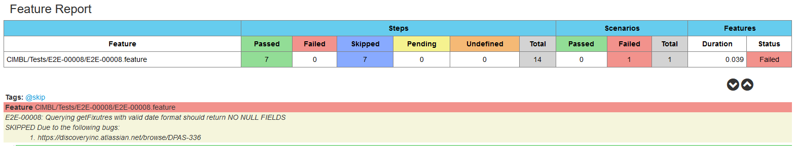

# CIMBL API TEST
---
This project is intended to test CIMBL API using the [Karate Framework](https://intuit.github.io/karate/). 

### Prerequisites
1. Java Development Kit
2. Maven

### To Do
1. IAM authentication

### Folder Structure

### Creating Feature Files
`./bin/generate-new feature`

### Creating Test Files
`./bin/generate-new test`

### Running The Tests

IMPORTANT NOTE: IT IS IMPORTANT THAT YOU RUN `gimme-aws-creds` AND CHOOSING THE RIGHT TENANT FOR THE ENVIRONMENT THAT YOU WILL BE RUNNING THE TEST ON.

`./run-test.sh [-r|-runTag <Regression|E2E|TEST_ID|CustomTags>] [-e|-env <qa|staging|prod>] [-a|-authType <apiKey|IAM>]`

e.g.

`./run-test.sh -r Regression -a apiKey -e qa,staging `

### Skipping tests
There are times when you expect that a test will fail due to a known bug. In this situation you need to skip the test
by adding @skipqa @skipdev in the E2E Test level

e.g. Tests/E2E-00008/E2E-00008.feature

    @skipqa @skipdev
    Feature:  E2E-00008: Querying getFixutres with valid date format should return NO NULL FIELDS
              SKIPPED Due to the following bugs:
                1. https://discoveryinc.atlassian.net/browse/DPAS-336

This will skip all steps and mark the final status as failed with test steps treated both as Passed and Skipped.
Make sure that you leave a note in the feature statement about why it was skipped so everyone will be informed.

### Sample Report

